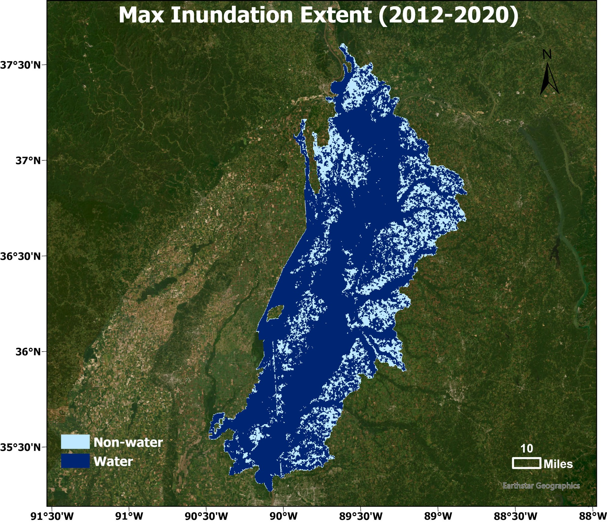

# Real-time Flood Inundation Forecasting with Satellite Observations and In-situ Streamflow Data

**Author:** Yue Li  
**Course:** GEOL 2283 Remote Sensing  
**Date:** Dec 3, 2025  
**University of Houston**

---

## 1. Introduction
Accurate and timely flood extent forecasting is crucial for flood management and disaster response. While traditional hydrodynamic modeling is capable of simulating the water flow within a watershed, it faces significant challenges in large-scale applications due to sensitivity to uncertain inputs and high computational complexity. 

In this project, we present a novel **real-time flood forecasting model** based on a **Convolutional Long Short-Term Memory (ConvLSTM)** network. The model effectively integrates multimodal data sources to capture both spatial and temporal dependencies of flood dynamics. Its **encoder-decoder architecture** enhances interpretability by clearly separating input-to-state transformation from state-to-state generation. 

Experimental results on the **Upper Mississippi Alluvial Plain (UMAP)** validate the model’s effectiveness in spatio-temporal flood extent mapping.

## 2. Data

### VIIRS Water Fraction Maps
We utilize data from the Visible Infrared Imaging Radiometer Suite (VIIRS) on board SNPP/NOAA-20 satellites. These maps provide high-resolution (375m) daily monitoring of surface water, essential for detecting inundation patterns.

### USGS Streamflow Data
In-situ streamflow measurements (gauge height/discharge) from the United States Geological Survey (USGS) are integrated to provide ground-truth hydrological constraints and improve temporal accuracy.

## 3. Study Area
**Upper Mississippi Alluvial Plain (UMAP)** A large river basin in the U.S. prone to seasonal flooding.

---

## 4. Long-term Flood Pattern Analysis

### Data Processing
Preprocessing involves addressing cloud cover gaps and temporal interpolation to create continuous flood records.

| **Original Water Fraction Map** | **After Temporal Interpolation** |
|:---:|:---:|
| <video src="Sample_Original.mp4" controls="controls" width="100%"></video> | <video src="Sample_Interoplated.mp4" controls="controls" width="100%"></video> |
| *Original data with gaps* | *Gap-filled continuous data* |

### Flood Dynamics Analysis (2012–2020)

**Flood Frequency Map & Max Extent** By analyzing the time-series data, we derived the inundation frequency and maximum extent to identify high-risk zones.

| Flood Frequency | Max Frequency | Max Inundation Extent |
|:---:|:---:|:---:|
|  |  |  |

---

## 5. Real-time Flood Forecasting

### Methodology
We employ a Deep Learning approach combining satellite imagery and gauge data.

* **Overall Framework**: Integration of VIIRS and USGS data.
* **Model Architecture**: ConvLSTM (Encoder-Decoder) to predict future frames based on historical sequences.

| Overall Framework | ConvLSTM Structure |
|:---:|:---:|
|  |  |

### Case Studies Results

Here we compare the model inputs (past days) with the model predictions (forecasted days).

#### Case Study 1
*Input Sequence vs. Forecasting Output*

| Input (T-n) | Forecast (T+1) | Forecast (T+2) | Forecast (T+3) |
|:---:|:---:|:---:|:---:|
|  |  |  |  |

**Comparison with Ground Truth:**

#### Case Study 2
*Input Sequence vs. Forecasting Output*

| Input (T-n) | Forecast (T+1) | Forecast (T+2) | Forecast (T+3) |
|:---:|:---:|:---:|:---:|
|  |  |  |  |

**Comparison with Ground Truth:**

---

## 6. Summary

**Spatio-temporal Analysis (2012–2020)**
* Visualized long-term flood patterns using Inundation Frequency Maps and Maximum Inundation Extent Maps.
* Validated the strong temporal correlation between Remote Sensing observations and in-situ measurement data.

**Real-time Flood Forecasting**
* Developed a robust deep learning model (ConvLSTM) for flood forecasting.
* **Limitation:** Performance is occasionally limited by heavy cloud cover in optical imagery, which can lead to under/over-prediction in specific extreme events.

---
*Created for GEOL 2283 Course Project | University of Houston*
